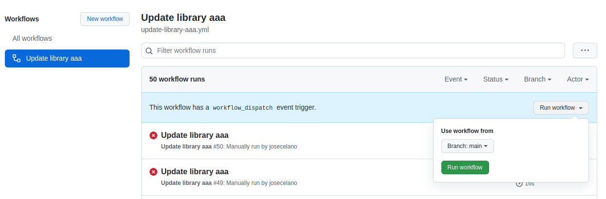
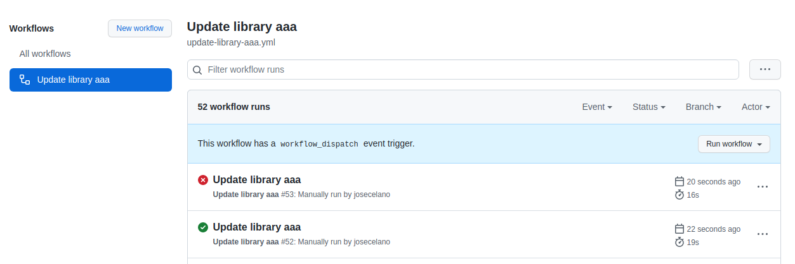
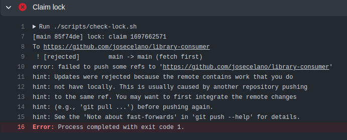

# Library Consumer

>NOTE: We think this idea can be very useful for a lot of projects so we decided to create a [GitHub Action](https://github.com/Nautilus-Cyberneering/git-queue).

Crazy idea: let's use git empty commits as a concurrency lock to provide exclusive access to git merges.

The problems we are trying to solve:

- We want to generate some auto-commits after a submodule is updated. We call the submodule the "library".
- We want to have exclusive access to git merges while running those changes. We do not want any other process to commit changes into the `main` branch. For example, to avoid duplicate commits.

We need a concurrency solution and we do not want to use GitHub Actions "concurrency" groups.

- If you want to gain exclusive access to git merges, you can push an empty commit claiming a lock.
- If you get the lock, nobody can push into the branch. They will wait until you push a new commit to release the lock.
- Race conditions for the "claim lock" commits are solved by allowing only fast forwards merges.

Proof of Concept based on this issue: <https://github.com/Nautilus-Cyberneering/chinese-ideographs-website/issues/19>

**Requirements**:

- We have a git repo containing only text files. We call it [library-aaa](https://github.com/josecelano/library-aaa).
- We want to mirror the content of that library into this repo in the folder `libraries_mirror/aaa`.
- We want to create a workflow as a cronjob that pulls the latest version of the library every 10 minutes and sync the changes.
- We can create only one commit to apply all changes.
- Source folder: <https://github.com/josecelano/library-aaa/tree/main/data>
- Folder mirror: [libraries_mirror/aaa](./libraries_mirror/aaa)

This solution has some potential concurrency problems. They can be solved by using the workflow attribute [concurrency](https://docs.github.com/en/actions/learn-github-actions/workflow-syntax-for-github-actions#concurrency)

**Why do not use GitHub concurrency group**:

- We do not want to be coupled to GitHub infrastructure. The solution should work on any other server.
- In the future, we could also try to prevent developers from merging their changes into the main branch when the critical workflow is being executed.
- It could work for other changes into main that require exclusive execution.

**Alternative solution**:

We want to implement a different solution by using a git empty commit as a lock for the update.

Pessimistic locking solution:

- Only one workflow can update the library. We need to enforce mutual exclusion for workflows updating the library.
- We want to use a [lock](https://en.wikipedia.org/wiki/Lock_(computer_science)) mechanism.
- When a thread (workflow) wants to update the library, it has to claim the lock first and release it at the end of the process.
- "Claim the lock" means to create an empty commit and push it into the `main` branch. If a second workflow tries to do the same it's going to get a merge conflict because we use fast forward merges. The first workflow pushing to main will get the lock.
- Regardless of whether the workflow succeeds or fail, we have to release the lock at the end of the execution.

Optimistic locking solution:

- There are two workflows: `work-allocator` and `worker`.
- The `work-allocator` only checks if there is a pending job (a new library commit). If there is an update, it pushes a commit into main to claim the lock.
- The `workers` can check if there is a pending job by checking if there is a lock not released yet in the commit history.
- Race conditions in both cases are avoided with git merge conflicts when the workflows try to push to main.

**Pros**:

- We do not need to rely on an external service.
- We can have more than one lock for different tasks. We can have N one-task queues.
- We should not waste too much CPU. The only common case where there would be reprocessed work is when an unrelated PR is merged in in-between the processing time of a Worker Thread. This would require the worker thread to be attempted again later after the failed fast-forward merge.
- Unless we do something very wrong, there should never be a deadlock from merge conflicts with the "optimistic approach", When there is a merge conflict, the work is simply disregarded and re-attempted later on by the cron job, therefore releasing the lock at a later time (without the merge conflict).
- It is indeed possible to construct a special "Global" or "World" lock as a way to lock any other merge into the main branch.

**Cons**:

- If we want to avoid too many merge conflicts, we have to pause other manual PR merges when the workflow is being executed.

**Potential problems**:

- You can not use the specific commit subject used by this protocol.

## Error examples we are trying to solve with this solution

### Example 1: overwrite a newer version of the file

Note: a new workflow is executed every 10 minutes.

- `T1`. Add a new file to the library (`1.txt`)
- `T2`. We run `W1` to update the library. For some reason, this process takes more than 10 minutes.
- `T3`. We modify the file `1.txt` in the library.
- `T4`. (T2+10") We run a second workflow `W2` to update the library.
- `T5`. The workflow `W2` finishes and creates a commit with the second version of file `1.txt`.
- `T6`. The workflow `W1` finishes and overwrites the first version of the file `1.txt`.

## Testing

You can run workflows in parallel by triggering the workflow manually:



In order to import changes from the [library](https://github.com/josecelano/library-aaa), first you need to create or change a text file on the [library data folder](https://github.com/josecelano/library-aaa/tree/main/data). You can force a change in the library with an empty commit:

```shell
git ci --allow-empty -m "trigger workflow on consumer repo"
```

When the workflow finishes the log output should be something like:

```console
* 0340edd - (origin/main) 📝✅: library-update: job.ref.8c017ac2298c0039cf5a81cadbf2e6143604f206 (2022-02-23 17:02:31 +0000) <NautilusCyberneering[bot]>
* 5e05fe8 - update library aaa to commit fb1df3a3aa113e0e3d2ec8f6c44e3d189660e505 (2022-02-23 17:02:28 +0000) <A committer>
* 0e00d62 - 📝👔: library-update: job.ref.8c017ac2298c0039cf5a81cadbf2e6143604f206 (2022-02-23 17:02:27 +0000) <NautilusCyberneering[bot]>
* 730e0e0 - remove all embedded git-queue test workflow (2022-02-23 17:02:04 +0000) <Jose Celano>
* 8c017ac - 📝🈺: library-update (2022-02-23 17:01:07 +0000) <NautilusCyberneering[bot]>
```

The second workflow executed should fail:



With this message:



## Git commands

Pull changes, including submodules.

```shell
git pull --recurse-submodules
```
